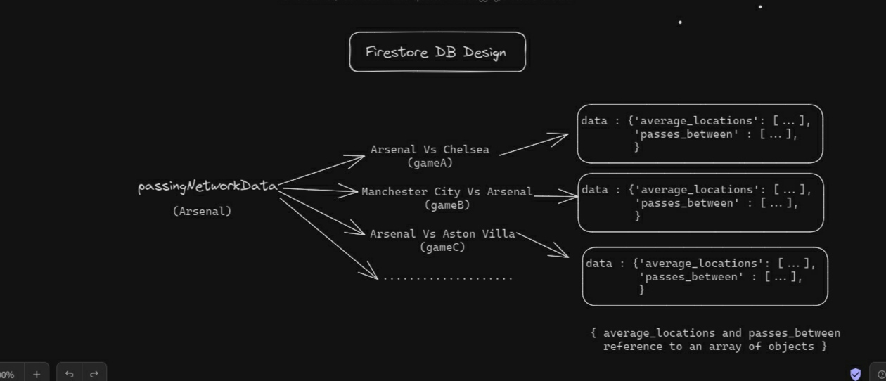

# EPL ANALYTICS

EPL ANALYTICS - An in-depth analytics website for English Premier League fans showcasing detailed statistics and interactive data visualizations for the top six teams from the 2022-2023 season.

[https://pl-analytics.netlify.app/](https://pl-analytics.netlify.app/)

## Table of Contents

- [Installation and Local Setup](#installation-and-local-setup)
- [Features](#features)
- [Built with](#built-with)
- [Firestore Design](#firestore-design)
- [Ideas For V2](#ideas-for-v2)

## Installation and Local Setup

To install and run EPL Analytics locally, follow these steps:

1. Clone the repository:
git clone https://github.com/Shivank12batra/PL-Data-Viz-Website

2. Install the dependencies:
$ npm install

3. Start the local development server:
$ npm run dev

## Features

- Carousel Home Page Animation Using React Spring
- Interactive Team Table With Column Sorting Options
- Team Graphics: Cumulative xG Chart, Passing Network Chart And Team Shotmap
- Player Graphics: Player Rankings Bar Chart, Player Report Card And EventMap
- Matchday Section (Coming soon as part of V2!)
- Glossary Section 

## Built with

- React JS
- React Query For Data Fetching And Caching
- React Router v6
- Tailwind CSS
- D3.js For Data Visualizations
- Firebase

## Firestore Design

One of the major challenges of this project was not frontend/UI related but instead was related to collection and managing data.

Since, there was no freely available public API for the kind of data I wanted, I had to scrape data from three different sources to fulfill my requirements. Here is the repo containing the jupyter notebook which contains all the scraper functions: [https://github.com/Shivank12batra/PL-Data-Viz-Firebase-Data](https://github.com/Shivank12batra/PL-Data-Viz-Firebase-Data)

I had three types of data that I required for displaying various types of graphs/vizzes:

Schemas For Each Kind Of Collection:

### shotsData(event) and playersData (aggregated) firestore schema:

### playerEventData firestore schema:

### passingNetworkData firestore schema:

## Ideas For V2

Matchday section will be unleashed as part of v2. There is also plan to add more vizzes + also a potential comparison section to compare your favourite team players with players of other teams in the league. 

I am open to feedback and suggestions and if there are any, I would love to hear them and you contact me [here](https://www.linkedin.com/in/shivank-batra-4594b9202/)

